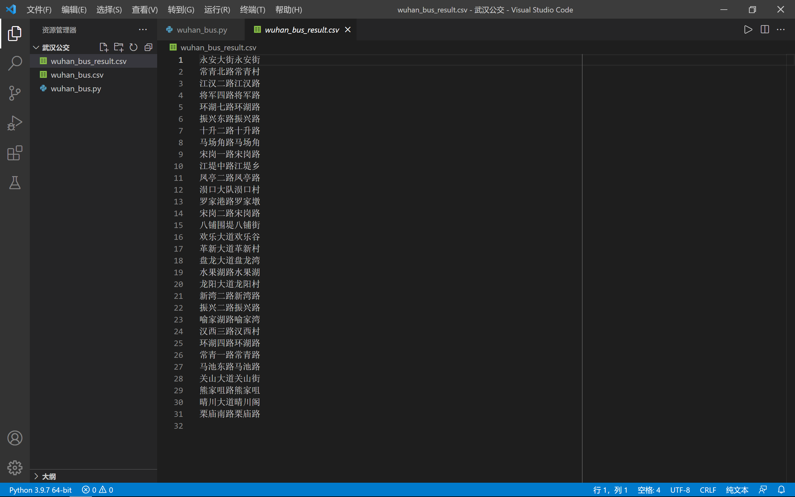

### 爬取武汉所有的公交站名

>国庆深度游武汉的时候，我发现，“晴川大道晴川阁”和“江堤中路江堤乡”这两个公交站名有点意思啊，很骚啊。于是我就想，不会吧，不会吧，全武汉该不会只有这两个这样式名字的公交站吧。
>
>于是，现在答案来了，在我爬取了全武汉760条公交线路的7734个站点后，一共找到了31个。

#### 确定[目标网站](https://m.8684.cn/wuhan_buslist)

#### 思路步骤

第一步，分析网站，获取`urls`。

```python
def get_area_urls():
    urls = [
        'https://m.8684.cn/wuhan_t{}'.format(str(i)) for i in range(2, 16, 1)]
    return urls
```

第二步，请求这些地区分类`url`，获得车次的`urls`。

```python
def get_bus_urls(area_urls):
    obj = re.compile(r'<a href="/wuhan_x_(?P<url>.*?)" title=".*?">.*?</a>', re.S)
    bus_urls = []
    for area_url in area_urls:
        resp = requests.get(area_url)
        bus_hrefs = obj.finditer(resp.text)
        for bus_href in bus_hrefs:
            dic = bus_href.groupdict()
            bus_urls.append('https://m.8684.cn/wuhan_x_' + dic['url'])
        resp.close()
    return bus_urls
```

第三步，请求车次的`url`，获得站名，并且写入文件。

```python
def get_station(bus_url):
    f = open('wuhan_bus.csv', mode='a+', encoding='utf-8', newline='')
    csvwriter = csv.writer(f)
    station_list = []
    bus_resp = requests.get(bus_url)
    page = BeautifulSoup(bus_resp.content, 'html.parser')
    bus_name = page.find('h1')
    station_list.append(bus_name.text[:-1])
    div = page.find('div', class_="cell-group show")
    stations = div.find_all('span', class_="place")
    for station in stations:
        station_list.append(station.text.strip())
    csvwriter.writerow(station_list)
    bus_resp.close()
    f.close()
```

第四步，读取文件，获得我们需要的站点，写入结果文件。

```python
def get_result():
    list = []
    with open('wuhan_bus.csv', 'r', encoding='utf-8') as f:
        reader = csv.reader(f)
        for bus_line in reader:
            for station in bus_line:
                # 筛选条件
                if len(station) == 7 and station[0] == station[4] \
                	and station[1] == station[5]:
                    list.append(station)
    list = set(list)    # 剔除重复结果
    f = open('wuhan_bus_result.csv', 'w', encoding='utf-8', newline='')
    csvwriter = csv.writer(f)
    for station in list:
        csvwriter.writerow([station])
    f.close()
```

#### 结果展示



#### 贴一份完整代码

```python
import requests
from bs4 import BeautifulSoup
import csv
import re


def get_station(bus_url):
    f = open('wuhan_bus.csv', mode='a+', encoding='utf-8', newline='')
    csvwriter = csv.writer(f)
    station_list = []
    bus_resp = requests.get(bus_url)
    page = BeautifulSoup(bus_resp.content, 'html.parser')
    bus_name = page.find('h1')
    station_list.append(bus_name.text[:-1])
    div = page.find('div', class_="cell-group show")
    stations = div.find_all('span', class_="place")
    for station in stations:
        station_list.append(station.text.strip())
    csvwriter.writerow(station_list)
    bus_resp.close()
    f.close()


def get_area_urls():
    area_urls = [
        'https://m.8684.cn/wuhan_t{}'.format(str(i)) for i in range(2, 16, 1)]
    return area_urls


def get_bus_urls(area_urls):
    obj = re.compile(
        r'<a href="/wuhan_x_(?P<url>.*?)" title=".*?">.*?</a>', re.S)
    bus_urls = []
    for area_url in area_urls:
        resp = requests.get(area_url)
        bus_hrefs = obj.finditer(resp.text)
        for bus_href in bus_hrefs:
            dic = bus_href.groupdict()
            bus_urls.append('https://m.8684.cn/wuhan_x_' + dic['url'])
        resp.close()
    return bus_urls


def get_result():
    list = []
    with open('wuhan_bus.csv', 'r', encoding='utf-8') as f:
        reader = csv.reader(f)
        for bus_line in reader:
            for station in bus_line:
                if len(station) == 7 and station[0] == station[4] and station[1] == station[5]:
                    list.append(station)
    list = set(list)    # 剔除重复结果
    f = open('wuhan_bus_result.csv', 'w', encoding='utf-8', newline='')
    csvwriter = csv.writer(f)
    for station in list:
        csvwriter.writerow([station])
    f.close()


def main():
    # 获得地区分类的url
    area_urls = get_area_urls()
    print("get_area_urls is ok")
    # 获得所有车的url
    bus_urls = get_bus_urls(area_urls)
    print("get_bus_urls is ok")
    # 去所有车的url里面找到所有的站点
    for bus_url in bus_urls:
        get_station(bus_url)
        print(f"{bus_url} get_station is ok")
    # 分析数据，得到我们要的结果
    get_result()


if __name__ == '__main__':
    main()
```

