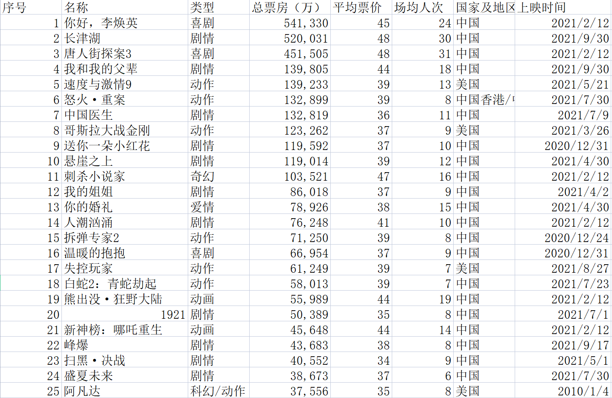

### 爬取的网站

> [艺恩年度票房](https://www.endata.com.cn/BoxOffice/BO/Year/index.html)

因为网站有对数据进行加密，所以这里用的是`selenium`来实现。

### 步骤

为了加快速度，这里采用无头浏览器的方式。

```python
opt = Options()
opt.add_argument("--headless")
opt.add_argument("--disable-gpu")

web = Chrome(options=opt)
```

获取下拉菜单的`xpath`，然后包装成下拉菜单。

```python
sel_el = web.find_element_by_xpath('//*[@id="OptionDate"]')
sel = Select(sel_el)
```

数据处理，因为得到的`tr`是我不明白的东西，所以写的麻烦了一点。

```Python
for i in range(len(sel.options)):
    sel.select_by_index(i)
    time.sleep(2)
    trs = web.find_elements_by_xpath('//*[@id="TableList"]/table/tbody/tr')
    for tr in trs:
        string = str(tr.text)
        string.encode('utf-8')
        string = string.replace('\n', ',').replace(' ', ',')
        print(string)
        xuhao = string.split(',')[0]
        name = string.split(',')[1]
        leixin = string.split(',')[2]
        piaofan = string.split(',')[3] + ',' + string.split(',')[4]
        piaojia = string.split(',')[5]
        changjunrenci = string.split(',')[6]
        diqu = string.split(',')[7]
        shijian = string.split(',')[8]
```

最后，将数据写入`csv`文件即可。

```python
with open("csv\movies.csv", mode='a', encoding='utf-8', newline='') as f:
            csvwriter = csv.writer(f)
            csvwriter.writerow(
                [xuhao, name, leixin, piaofan, piaojia, changjunrenci, diqu, shijian])
```

### 完整代码

```python
from selenium.webdriver import Chrome
from selenium.webdriver.chrome.options import Options
from selenium.webdriver.support.select import Select
import time
from lxml import etree
import csv

opt = Options()
opt.add_argument("--headless")
opt.add_argument("--disable-gpu")

web = Chrome(options=opt)

web.get("https://www.endata.com.cn/BoxOffice/BO/Year/index.html")

time.sleep(2)

sel_el = web.find_element_by_xpath('//*[@id="OptionDate"]')
sel = Select(sel_el)

with open("csv\movies.csv", mode='a', encoding='utf-8', newline='') as f:
    csvwriter = csv.writer(f)
    csvwriter.writerow(['序号', '名称', '类型', '总票房（万）',
                       '平均票价', '场均人次', '国家及地区', '上映时间'])

for i in range(len(sel.options)):
    sel.select_by_index(i)
    time.sleep(2)
    trs = web.find_elements_by_xpath('//*[@id="TableList"]/table/tbody/tr')
    for tr in trs:
        string = str(tr.text)
        string.encode('utf-8')
        string = string.replace('\n', ',').replace(' ', ',')
        print(string)
        xuhao = string.split(',')[0]
        name = string.split(',')[1]
        leixin = string.split(',')[2]
        piaofan = string.split(',')[3] + ',' + string.split(',')[4]
        piaojia = string.split(',')[5]
        changjunrenci = string.split(',')[6]
        diqu = string.split(',')[7]
        shijian = string.split(',')[8]
        with open("csv\movies.csv", mode='a', encoding='utf-8', newline='') as f:
            csvwriter = csv.writer(f)
            csvwriter.writerow(
                [xuhao, name, leixin, piaofan, piaojia, changjunrenci, diqu, shijian])

```

### 数据展示


